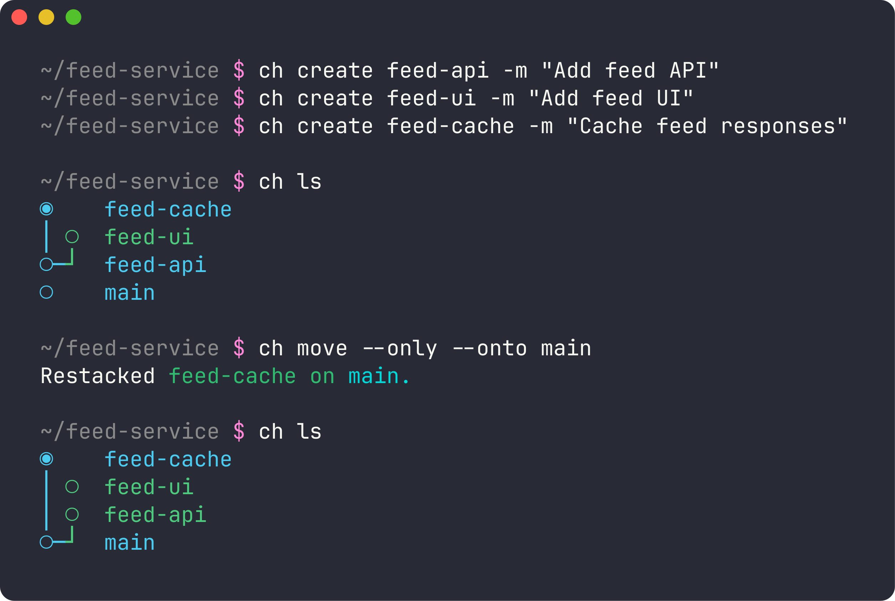

# Charcoal

> A CLI for managing stacked pull requests, with the same commands and flags as Graphite's `gt`.



This is a fork of [danerwilliams/charcoal](https://github.com/danerwilliams/charcoal), the open-source
continuation of the Graphite CLI. Upstream froze at the 2023 command set; this fork brings it level with
Graphite's current `gt`: same command names, aliases, flags, defaults and behavior, with `ch` as the binary.
It needs no Graphite account and talks to GitHub through the [GitHub CLI (`gh`)](https://cli.github.com).

## Install

```sh
brew install fbarretto/tap/charcoal
```

Homebrew works on macOS and Linux and pulls in `gh` (and `git-absorb`, used by `ch absorb`). Without
Homebrew, download the binary for your platform from the
[latest release](https://github.com/fbarretto/charcoal/releases/latest) and put it on your `PATH`:

```sh
# macOS Apple silicon; use ch-macos-x64 or ch-linux on other platforms
curl -L -o ch https://github.com/fbarretto/charcoal/releases/latest/download/ch-macos-arm64
chmod +x ch && mv ch ~/.local/bin/
```

From source (needs Node 20 and Bun):

```sh
git clone https://github.com/fbarretto/charcoal && cd charcoal
corepack yarn install && corepack yarn turbo run build
cd apps/cli && bun build --compile ./dist/src/index.js --outfile ~/.local/bin/ch
```

## Quick start

```sh
ch auth                        # once: reuses your gh login
ch init --trunk main           # once per repo: stack metadata lives in .git, nothing is committed
git add <files>
ch create my-feature -m "Add the feed API"
git add <files>
ch create my-feature-ui -m "Add the feed UI"
ch ls                          # view the stack
ch submit --stack              # push every branch and open or update its PR
ch sync                        # after merges: pull trunk, delete merged branches, restack
```

Every `gt` command maps to the same `ch` command, so Graphite's own guides apply. If you have muscle memory
for `gt`, `alias gt=ch`. The full reference is **[DOCUMENTATION.md](./DOCUMENTATION.md)**.

## What this fork adds over upstream Charcoal

| Area                  | Commands                                                                                                          |
| --------------------- | ----------------------------------------------------------------------------------------------------------------- |
| Restructure a stack   | `move --only`, `create --onto`, `delete --upstack/--downstack/--close`, `split --by-file`, `fold --stack/--close` |
| Edit commits in place | `modify --into <branch>`, `absorb` (wraps [git-absorb](https://github.com/tummychow/git-absorb)), `revert <sha>`  |
| Safety                | `undo` (per worktree), `abort` (restores the state before the halted command), `freeze` / `unfreeze`              |
| Inspect and navigate  | `parent`, `children`, `trunk`, `info [branch] --stat`, `up --to`, `checkout --trunk/--stack`                      |
| GitHub                | `merge` (bottom-up), `pr [--stack]`, `unlink`, `unstack`, and `submit`'s full flag set                            |
| Setup                 | `config`, `aliases` (stored in `~/.config/charcoal/aliases`), `auth -t`, global `--cwd` and `--quiet`             |

Defaults now match `gt`: `sync` restacks, `modify` opens the editor only with `-e`, `create` with no name
names the branch from the commit message, `track` is recursive, and scripts (no terminal on stdin/stdout)
run non-interactively. Branches checked out in another worktree are skipped during restacks, as in `gt`.

### Native GitHub stacks

`ch submit` also links the submitted PRs as a [GitHub stacked PR](https://docs.github.com/en/pull-requests/get-started/about-stacked-prs),
so reviewers see the stack map on github.com. It creates, extends or recreates the stack to match your local
chain. Opt out with `ch submit --no-gh-stack` or turn it off per repo in `ch config`. `ch unstack` removes
the stack on GitHub; `ch ls` shows each stack's number.

### Not supported

Anything that needs Graphite's servers: `--ai`, `gt dash`, Graphite's merge queue, and Graphite's web review
UI. Multiple trunks (`trunk --add`, the `--all` flags) are not implemented yet.

## Releases

Pushing a `v*` tag runs the test suite, builds the macOS and Linux binaries with Bun, publishes a GitHub
release, and updates the formula in [fbarretto/homebrew-tap](https://github.com/fbarretto/homebrew-tap).

## Background

On 7/14/2023 Graphite [closed open-source development of its CLI](https://github.com/withgraphite/graphite-cli)
and later limited free use. The CLI never needed Graphite's API to manage stacks, so
[Charcoal](https://danewilliams.com/announcing-charcoal) kept it open source and free for any GitHub
repository. Graphite also offers a full code review platform and merge queue; check them out if your team
wants more than the CLI.

## Contributing

See [CONTRIBUTING.md](./CONTRIBUTING.md). Licensed under [AGPL-3.0](./LICENSE).
